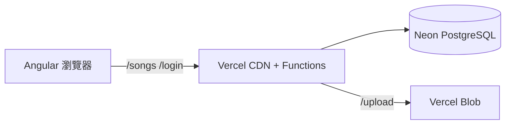

# Meowic 雲端部署指南（Vercel + Neon 免費方案）

本專案已將原本的 `json-server` 改為：

- **前端**：Angular（部署在 Vercel 靜態託管）
- **後端**：Vercel Serverless Functions（`api/` 目錄）
- **資料庫**： [Neon](https://neon.tech) PostgreSQL（免費額度）
- **檔案上傳**： [Vercel Blob](https://vercel.com/docs/storage/vercel-blob)（免費 Hobby 額度）

---

## 一、建立免費 PostgreSQL（Neon）

1. 前往 https://neon.tech 註冊帳號。
2. 建立新專案（Project），區域選離你最近的（例如 `ap-southeast-1`）。
3. 在 **Connection string** 複製 `postgresql://...`（需含 `?sslmode=require`）。
4. 在本機專案根目錄建立 `.env`（可複製 `.env.example`）：

```env
DATABASE_URL=postgresql://你的連線字串
JWT_SECRET=請改成至少32字元的隨機字串
```

5. 安裝依賴並初始化資料庫：

```bash
npm install
npm run db:init
npm run db:seed
```

`db:seed` 會把現有 `db.json` 的資料匯入 Neon。

---

## 二、本機開發

開兩個終端機：

**終端 1 — API**

```bash
npm run dev:api
```

預設 `http://127.0.0.1:3001`

**終端 2 — Angular**

```bash
npm start
```

`ng serve` 會透過 `proxy.conf.json` 把 `/login`、`/songs` 等請求轉到本機 API。

> 舊的 `npm run api`（json-server）仍可使用，但新功能請以 `dev:api` 為主。

---

## 三、部署到 Vercel

### 1. 推送程式碼到 GitHub

將專案推到 GitHub（或 GitLab / Bitbucket）。

### 2. 匯入 Vercel 專案

1. 登入 https://vercel.com
2. **Add New → Project** → 選擇你的 repo
3. Framework Preset 選 **Other**（或讓 Vercel 讀取 `vercel.json`）
4. 確認設定：
   - **Build Command**：`npm run build`
   - **Output Directory**：`dist/meowic/browser`

### 3. 設定環境變數

在 Vercel 專案 → **Settings → Environment Variables** 新增：

| 變數 | 說明 |
|------|------|
| `DATABASE_URL` | Neon 連線字串（與本機 `.env` 相同或另建 production DB） |
| `JWT_SECRET` | 正式環境用的 JWT 密鑰（勿與本機相同） |
| `BLOB_READ_WRITE_TOKEN` | 見下方 Blob 設定 |

### 4. 建立 Vercel Blob（上傳圖片／音檔）

1. 專案 → **Storage** → **Create Database** → 選 **Blob**
2. 建立後 Vercel 會自動加入 `BLOB_READ_WRITE_TOKEN`
3. 重新部署（Redeploy）讓環境變數生效

未設定 Blob 時，CMS 上傳會回傳 503；其餘 API 仍可正常使用。

### 5. 部署

點 **Deploy**。完成後網址類似：`https://meowic-xxx.vercel.app`

前端與 API 同網域，例如：

- 網站：`https://你的網域/`
- 登入：`POST https://你的網域/login`
- 歌曲：`GET https://你的網域/songs?_expand=album&_expand=artist`

---

## 四、架構說明



| 路徑 | 處理方式 |
|------|----------|
| `/login` | `api/login.js` |
| `/upload` | `api/upload.js` |
| `/songPlays` | `api/song-plays.js` |
| `/homeRecommendations` | `api/home-recommendations.js` |
| `/users`、`/songs`… | `api/resource.js` |
| 其他 | Angular `index.html`（SPA） |

---

## 五、免費額度參考（2026）

| 服務 | 免費方案重點 |
|------|----------------|
| **Vercel Hobby** | 個人專案、Serverless 執行時間有限 |
| **Neon Free** | 約 0.5 GB 儲存、專案可休眠 |
| **Vercel Blob Hobby** | 有限儲存與流量，適合開發／小型專案 |

若流量成長，可考慮 Neon 付費方案或 Supabase 作為替代資料庫。

---

## 六、常見問題

**Q: 部署後登入失敗？**  
確認已執行 `npm run db:seed`，且 Vercel 的 `DATABASE_URL` 指向有資料的那個 Neon 專案。

**Q: 圖片／音檔網址仍是 localhost？**  
`db.json` 內部分資料含 `http://localhost:3000/...`，匯入後需在 CMS 重新上傳，或手動更新 DB 中的 URL。

**Q: 想用 Supabase 代替 Neon？**  
Supabase 也提供免費 PostgreSQL，把 `DATABASE_URL` 換成 Supabase 的 connection string 即可（需 ssl）。

---

## 七、安全提醒（上線前建議）

- [ ] 將 `JWT_SECRET` 設為強隨機字串
- [ ] 密碼改為 bcrypt 雜湊（目前與 mock 相同為明碼，僅適合練習）
- [ ] 限制 `/users` 列表 API 勿回傳 `password` 欄位
